% Steam Audio Unity Plugin 2.0-beta.18

# Steam Audio Unity Plugin <small><small>2.0-beta.18</small></small>

Copyright 2017 Valve Corporation. All rights reserved. Subject to the following license: 
[https://valvesoftware.github.io/steam-audio/license.html](https://valvesoftware.github.io/steam-audio/license.html)

## Introduction
Thanks for trying out Steam Audio. It is a complete solution for adding 3D audio and environmental effects to your game
or VR experience. It has the following capabilities:

- **3D audio for direct sound.** Steam Audio binaurally renders direct sound using HRTFs to accurately model the 
  direction of a sound source relative to the listener. Users can get an impression of the height of the source, as well 
  as whether the source is in front of or behind them.

- **3D audio for Ambisonics recordings.** Steam Audio can also spatialize Ambisonics audio clips, rotating them based
  on the listener's orientation in the virtual world. This is useful for creating spatialized ambiences that are
  fixed in place relative to the virtual world.

- **Custom HRTFs using SOFA files.** In addition to its built-in HRTF, Steam Audio can spatialize point sources and
  Ambisonics sources using any HRTF specified by the user. These files should be in the AES standard SOFA format
  (https://www.sofaconventions.org/).

- **Occlusion and partial occlusion.** Steam Audio can quickly model raycast occlusion of direct sound by solid objects. 
  Steam Audio also models partial occlusion for non-point sources.

- **Model a wide range of environmental effects.** Steam Audio can model many kinds of environmental audio effects, 
  including slap echoes, flutter echoes, occlusion of sound by buildings, propagation of occluded sound along alternate 
  paths, through doorways, and more.

- **Create environmental effects and reverbs tailored to your scene.** Steam Audio analyzes the size, shape, layout, and 
  material properties of rooms and objects in your scene. It uses this information to automatically calculate 
  environmental effects by simulating the physics of sound.

- **Automate the process of creating environmental effects.** With Steam Audio, you don’t have to manually place effect 
  filters throughout your scene, and you don’t have to manually tweak the filters everywhere. Steam Audio uses an 
  automated real-time or pre-computation based process where environmental audio properties are calculated (using 
  physics principles) throughout your scene.

- **Dynamic geometry support.** Steam Audio can model how moving geometry impacts occlusion and environmental effects.
  For example, opening doors can result in an occluded sound becoming unoccluded; making a room larger during gameplay
  can increase the amount of reverb in it.

- **Generate high-quality convolution reverb.** Steam Audio can calculate convolution reverb. This involves calculating 
  Impulse Responses (IRs) at several points throughout the scene. Convolution reverb results in compelling environments 
  that sound more realistic than with parametric reverb. This is particularly true for outdoor spaces, where parametric 
  reverbs have several limitations.

- **Multi-core CPU and GPU acceleration.** Steam Audio can use multi-core CPUs to accelerate simulation of environmental
  effects. Steam Audio can also use supported GPUs for accelerating simulation and rendering of environmental effects,
  while ensuring that its audio workloads do not adversely impact other GPU workloads or frame rate stability.

- **Head tracking support.** For VR applications, Steam Audio can use head tracking information to make the sound field 
  change smoothly and accurately as the listener turns or moves their head.

### How Steam Audio Works
This section describes the various parts of Steam Audio, focusing on the way in which the computational load is divided 
between multiple threads. Steam Audio interacts with three main threads:

1. **Game Thread**. This thread controls the game state, and sends this information to the Simulation Thread. In Unity 
   parlance, the Game Thread is the thread on which MonoBehavior.Update is executed. This thread is managed by the game 
   engine, and runs as fast as the game engine chooses to execute it, which might be 60 Hz assuming vsync is enabled.

2. **Simulation Thread.** This thread actually carries out the sound propagation simulation, and performs the bulk of 
   the computational work. It uses source and listener information provided by the Game Thread, and calculates an 
   impulse response for use by the Rendering Thread. This process involves ray tracing. This thread is managed 
   internally by Steam Audio, and runs as fast as it can, but no faster than the Rendering Thread.

3. **Rendering Thread.** This thread applies direct occlusion, 3D audio, and environmental effects to each sound source. 
   Steam Audio inserts DSP code into the main audio thread, to perform convolutions with multi-channel impulse 
   responses. This thread runs at the audio DSP rate, which is typically 512 or 1024 samples per frame, and 44100 (or 
   48000, depending on the audio driver) samples per second.

### Integration and Platforms
Steam Audio supports **Unity 2017.1 or higher**. If you are using a different game engine or audio middleware, you will 
need to use the Steam Audio C API. Refer to the *Steam Audio API Reference* for further information.

The Steam Audio Unity plugin currently supports:

* Windows 7 or later (32-bit and 64-bit)
* Linux (32-bit and 64-bit, tested with Ubuntu 16.04 LTS)
* macOS 10.7 or later
* Android 5.0 or later (32-bit ARM, 64-bit ARM, 32-bit Intel)

## Unity Integration
This chapter explains how to use Steam Audio with Unity. It assumes that you are using Unity’s built-in native audio 
engine.

### Setting Up Your Unity Project

#### Importing Steam Audio
Before using Steam Audio in Unity, you must add it to your Unity project. To integrate Steam Audio into your Unity 
project:

1.  From the Unity menu, choose **Assets** > **Import Package** > **Custom Package**.
2.  Navigate to the directory where you downloaded Steam Audio. Within this folder, navigate to the 
    <code>bin/unity/</code> subdirectory.
3.  Double-click the <code>SteamAudio.unitypackage</code> file.
4.  In the Import dialog box that appears, make sure everything is selected, and click the **Import** button.

#### Unity Project Settings
Before using Steam Audio to spatialize Audio Sources in Unity, you must select Steam Audio as your spatializer plugin:

1.  Click **Edit** > **Project Settings** > **Audio**.
2.  Under **Spatializer Plugin**, choose **Steam Audio Spatializer**.
3.  Under **Ambisonic Decoder Plugin**, choose **Steam Audio Ambisonics** if using Ambisonic audio clips in your project.

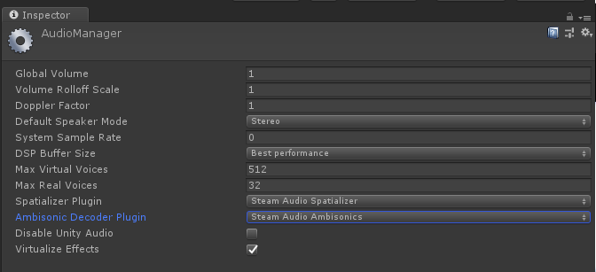

> **NOTE**  
  This step is not required if you are only using Steam Audio for listener-centric reverb.

If you're using a version of Unity older than 5.6.0, and Steam Audio Spatializer does not show up in the Spatializer
Plugin dropdown, follow these steps:

  1. In the Project tab, select:
    - `Assets/Plugins/x86_64/audioplugin_phonon.dll` (if using the 64-bit Windows editor),
    - `Assets/Plugins/x86/audioplugin_phonon.dll` (if using the 32-bit Windows editor), or
    - `Assets/Plugins/audioplugin_phonon.bundle` (if using the macOS editor).
  2. In the Inspector tab, make sure **Any Platform** is unchecked, and **Editor** and **Standalone** are checked.

#### Steam Audio Settings
For each scene where you plan to use Steam Audio, you must set up Steam Audio to work with your audio engine (in this 
case, Unity’s built-in audio engine):

1.  Click **Window** > **Steam Audio**. You may dock the Steam Audio window that appears to any part of the Unity window 
    that you prefer.
2.  Under **Audio Engine**, choose **Unity**. 

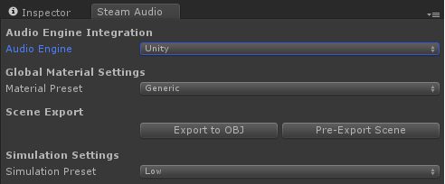

##### Steam Audio Manager
A Steam Audio Manager component must be present in your scene to use Steam Audio. A GameObject named 
**Steam Audio Manager Settings**, containing a Steam Audio Manager component, will be created automatically when you 
click **Window** > **Steam Audio**.

### Direct Sound
Steam Audio offers an easy way to model the direct (straight-line) path of sound from the source to the listener,
including effects like distance attenuation, occlusion, transmission, and HRTF-based binaural rendering. This is in
contrast to indirect sound, including effects like reflections and reverb, which will be discussed later.

#### 3D Audio
Each sound source in Unity is represented by an Audio Source component attached to a GameObject. To add 3D audio with 
default settings, without adding any occlusion or indirect sound:

1.  Select the GameObject containing the Audio Source.
2.  In the Inspector view, under the Audio Source component, check **Spatialize**.

##### Spatial Blend
Audio Source components provide a **Spatial Blend** parameter which allows users to blend between spatialized and
unspatialized versions of an Audio Clip. When using Steam Audio to spatialize an Audio Source, the Spatial Blend
parameter affects direct sound and distance attenuation. For example:

- When Spatial Blend is set to 1 (3D): The Audio Source is fully positional. Distance attenuation is applied, either
  Physics-Based Attenuation (if checked), or using the Audio Source's attenuation curve.
- When Spatial Blend is set to 0 (2D): The Audio Source is not spatialized at all. No distance attenuation is applied.
- When Spatial Blend is set to 0.5: The Audio Source is somewhat positional. Distance attenuation is partially
  applied, i.e., the Audio Source is not attenuated as much as with Spatial Blend set to 1.

Air absorption, occlusion, and indirect sound are always applied as configured in the Steam Audio Source settings.
They are not affected by Spatial Blend.

#### Direct Sound Settings
Steam Audio uses the following settings by default when spatializing an Audio Source:

- HRTF-based binaural rendering is enabled.
- Physics-based attenuation is off; the distance curve configured on the Audio Source is used.
- Frequency-dependent air absorption is off.
- Occlusion and transmission are off.
- Indirect sound (reflections and reverb) are off.

To change the default settings that are used by Steam Audio when spatializing an Audio Source, you must add a 
**Steam Audio Source** component to the GameObject containing the Audio Source component:

1.  Select the GameObject containing the Audio Source.
2.  In the Inspector view, click **Add Component**.
3.  In the Add Component menu, select **Steam Audio** > **Steam Audio Source**.

In this section, we only describe the direct sound settings for the Steam Audio Source component. **Direct sound 
settings can be changed while in Play mode in Unity** or programmatically while playing the game. Indirect sound 
settings will be discussed in a later section.

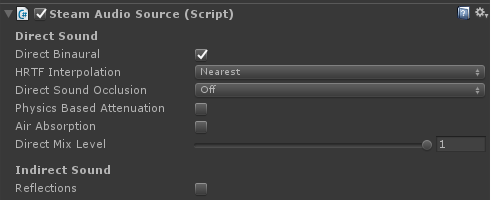

##### Direct Binaural
Check this box to enable HRTF-based 3D audio for direct sound. If unchecked, panning is used.

##### HRTF Interpolation
HRTF Interpolation specifies what interpolation scheme to use for HRTF-based 3D audio processing.

- **Nearest**. This option uses the HRTF from the direction nearest to the direction of the source for which HRTF data 
  is available.

- **Bilinear**. This option uses an HRTF generated after interpolating from four directions nearest to the direction of 
  the source, for which HRTF data is available. Bilinear HRTF interpolation may result in smoother audio for some kinds 
  of sources when the listener looks around, but has higher CPU usage (up to 2x) than Nearest HRTF interpolation.

##### Physics-Based Attenuation
When checked, physics-based distance attenuation (inverse distance falloff) is applied to the audio.

##### Air Absorption
When checked, frequency-dependent, distance-based air absorption is applied to the audio. Higher frequencies are
attenuated more quickly than lower frequencies over distance.

##### Directivity
Some sound sources emit sound largely within a limited range of directions. For example, a megaphone projects sound
mostly to the front. Steam Audio can model the effect of such source directivity patterns on both direct and
indirect sound. To specify a directivity pattern for a source, the following two sliders can be used:

- **Dipole Weight**. When set to 0, the source has a monopole directivity, i.e., is omnidirectional. When set to
  1, the source has a dipole directivity, i.e., sound is focused to the front and back of the source, and very little
  sound is emitted to the left or right of the source. Values in between blend between the two directivity patterns.
  At 0.5, for example, the source has a cardioid directivity, i.e., most of the sound is emitted to the front of the
  source.

- **Dipole Power**. Specifies how focused the dipole directivity is. Higher values result in sharper directivity
  patterns.

As you adjust these values, you can see a preview of the directivity pattern in the inspector.

##### Direct Mix Level
Direct Mix Level adjusts the contribution of direct sound to the overall mix.

#### Using Custom HRTFs
The Steam Audio Unity plugin allows users to replace Steam Audio's built-in HRTF with any HRTF of their choosing. This
is useful for comparing different HRTF databases, measurement or simulation techniques, or even allowing end users to
use a preferred HRTF with your game or app. Steam Audio loads HRTFs from _SOFA files_. The Spatially-Oriented Format
for Acoustics (SOFA) file format is defined by an Audio Engineering Society (AES) standard; for more details refer to
https://www.sofaconventions.org/.

To use a SOFA file:

1.  Copy it to the `Assets/StreamingAssets` folder in your Unity project.
2.  Click **Window** > **Steam Audio** to open the Steam Audio tab.
3.  Under **HRTF Settings**, expand **SOFA Files**.
4.  If there are no empty fields under **SOFA Files**, increase the value of **Size**.
5.  In one of the empty fields, enter the name of the SOFA file. For example if you have a file called
    `Assets/StreamingAssets/myhrtf.sofa`, enter `myhrtf.sofa` (or even `myhrtf`, the `.sofa` extension is optional).

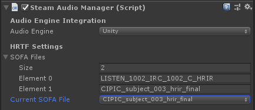

Once a SOFA file has been provided to Steam Audio, it needs to be selected for rendering. To do this:

1.  Click **Window** > **Steam Audio** to open the Steam Audio tab.
2.  Under **Current SOFA File**, select the SOFA file you want to use. Note that **Default** refers to Steam Audio's
    built-in HRTF, which does not require a SOFA file.

The current SOFA file can also be changed at run-time.

HRTFs loaded from SOFA files affect direct sound as well as indirect sound generated by Steam Audio Sources with
Indirect Binaural checked, Steam Audio Mixer Return effects with Binaural checked, or Steam Audio Reverb effects with
Binaural checked.

> **SOFA File Format Restrictions** 
> The SOFA file format allows for very flexible ways of defining HRTFs, but Steam Audio only supports a restricted
> subset. The following restrictions apply (for more information, including definitions of the terms below, refer to 
> https://www.sofaconventions.org/):
>
> * SOFA files must use the `SimpleFreeFieldHRIR` convention.
> * The `Data.SamplingRate` variable may be specified only once, and may contain only a single value. Steam Audio will
>   automatically resample the HRTF data to the user's output sampling rate at run-time.
> * The `SourcePosition` variable must be specified once for each measurement.
> * Each source must have a single emitter, with `EmitterPosition` set to `[0 0 0]`.
> * The `ListenerPosition` variable may be specified only once (and not once per measurement). Its value must be
>   `[0 0 0]`.
> * The `ListenerView` variable is optional. If specified, its value must be `[1 0 0]` (in Cartesian coordinates) or
>   `[0 0 1]` (in spherical coordinates).
> * The `ListenerUp` variable is optional. If specified, its value must be `[0 0 1]` (in Cartesian coordinates) or
>   `[0 90 1]` (in spherical coordinates).
> * The listener must have two receivers. The receiver positions are ignored.
> * The `Data.Delay` variable may be specified only once. Its value must be 0.

#### Occlusion
Steam Audio can model how sound is occluded by, and passes through, solid objects. Before changing any of the occlusion
settings described below, you must set up your scene geometry for use by Steam Audio; see the next section for details.

##### Direct Sound Occlusion
This specifies how occlusion is modeled, i.e., how solid objects affect sound passing through them.

- **Off**. Occlusion calculations are disabled. Sounds can be heard through walls and other solid objects. The scene
  setup does not need to be performed.

- **On, No Transmission**. Occlusion calculations are enabled. Occluded sound is inaudible.

- **On, Frequency Independent Transmission**. Occlusion calculations are enabled. Occluded sound is attenuated as it
  passes through geometry, based on the material properties of the occluding object. The attenuation is independent of
  frequency: the low, medium, and high frequency transmission coefficients are averaged, and the average value is used
  as a frequency-independent transmission coefficient.

- **On, Frequency Dependent Transmission**. Occlusion calculations are enabled. Occluded sound is filtered as it passes
  through geometry, based on the material properties of the occluding object. The filtering is dependent on frequency,
  so for example high frequencies may be attenuated more than low frequencies as the sound passes through geometry.

##### Occlusion Method
This dropdown is displayed whenever Direct Sound Occlusion is set to anything other than Off. It controls how
occlusion calculations are performed.

- **Raycast**. Performs a single raycast from the source to the listener to determine occlusion. If the ray is occluded, 
  direct sound is considered occluded. As described in the next section, the scene needs to be setup for Steam Audio.

- **Partial**. Performs multiple raycasts from the source to the listener based on the Source Radius setting. The 
  proportion of rays that are occluded determine how much of the direct sound is considered occluded. Transmission 
  calculations, if enabled, are only applied to the occluded portion of the direct sound. As described in next section, 
  the scene needs to be setup for Steam Audio.

##### Source Radius
This slider is only displayed when Occlusion Method is set to Partial. It configures the apparent size of the sound
source. The larger the source radius, the larger an object must be in order to fully occlude sound emitted by the
source.

#### Occlusion Settings
The following scene-wide settings can be configured for all sources that use partial occlusion. To configure them,
use **Window** > **Steam Audio** to open the Steam Audio tab.

##### Occlusion Samples
The number of rays that are traced from the listener to various points in a sphere around the source. Increasing this
number results in smoother transitions as the source becomes more (or less) occluded. This comes at the cost of
increased CPU usage.

#### Advanced Options
The following advanced options can be configured for a Steam Audio Source.

##### Avoid Silence During Init
Under some circumstances, Steam Audio Sources may take a few audio frames' worth of time to initialize. If this happens,
the default behavior is for a Steam Audio Source to emit silence while initialization is ongoing. Checking this box
modifies this behavior: the Steam Audio Source will pass its input audio unmodified while initialization is ongoing.

The default behavior is desirable for the common case where an occluded sound should not be audible for a few frames
while initialization occurs. On the other hand, for some kinds of sounds, like dialog, the default behavior may result
in the first few syllables becoming inaudible; checking this box will allow all the dialog to be heard.

### Ambisonic Audio
Steam Audio can decode and spatialize Ambisonic audio clips. If you plan to use Steam Audio to spatialize Audio Sources 
containing Ambisonic audio clips, make sure to select **Steam Audio Ambisonics** as your project's Ambisonic Decoder 
Plugin. (See above for more details.)

> **NOTE**  
  Set Spatialize to false on the Audio Source with the Ambisonic audio clip.

Steam Audio uses HRTF-based binaural rendering by default when spatializing an Audio Source that contains an Ambisonic 
audio clip. To change the default settings, you must add a **Steam Audio Ambisonics Source** component to the Audio 
Source:

1.  Select the GameObject containing the Audio Source.
2.  In the Inspector view, click **Add Component**.
3.  In the Add Component menu, select **Steam Audio** > **Steam Audio Ambisonics Source**.

#### Ambisonics Source Settings
In this section, we describe the settings for the Steam Audio Ambisonics Source component.

##### Enable Binaural
If checked, Steam Audio uses HRTF-based binaural rendering when spatializing the Ambisonic audio clip played by 
this Audio Source. If unchecked, Steam Audio uses panning to spatialize the Ambisonic audio clip.

#### Custom HRTF
Steam Audio automatically makes use of any custom HRTFs specified in the Steam Audio tab when spatializing Ambisonic 
Audio Sources. See the previous section on **Using Custom HRTFs** for more details.

### Scene Setup
To use Steam Audio for occlusion and environmental effects in your video game or VR experience, the scene needs to be 
set up by tagging geometry and specifying acoustic materials for the objects in your scene.

#### Tagging Geometry
Steam Audio needs to know what objects in your scene should be used to model occlusion and calculate environmental 
effects. You can specify this by tagging the relevant objects in multiple different ways.

##### Tagging Triangle Meshes
Any object with a Mesh Renderer component can be tagged with a **Steam Audio Geometry** component. Follow the steps 
below:

1.  Select the GameObject with Mesh Renderer you wish to tag.
2.  In the Inspector view, click **Add Component**.
3.  In the Add Component menu, click **Steam Audio** > **Steam Audio Geometry**.

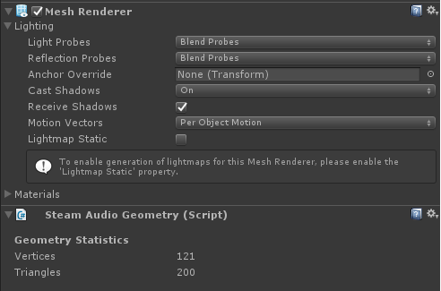

##### Tagging Terrain
Any object with a Terrain component can be tagged with a **Steam Audio Geometry** component.

Geometry that is represented by a Terrain component can be quite complex. This can slow down the calculation of 
occlusion and environmental effects. To speed things up, you can adjust the **Terrain Simplification Level** slider on 
the Steam Audio Geometry component. As you increase this value, Steam Audio will reduce the level of detail in the 
terrain. This will result in faster calculation of environmental effects.

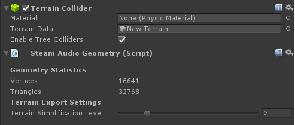

##### Tagging a Hierarchy of Objects
A scene is often organized as a hierarchy of objects. The scene hierarchy can be seen in the Hierarchy window in Unity.

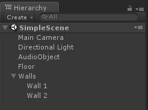

Any game object in the hierarchy window with child objects can tagged with a **Steam Audio Geometry** component. An 
option to **Export All Children** will be available in this case. If the option is selected, the geometry of all 
children with a **Mesh Renderer** or **Terrain** attached to them will be combined and used to model occlusion and 
environmental effects.

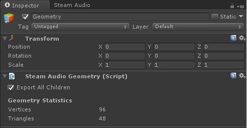

> **NOTE**  
  Tagging an object with Steam Audio Geometry does not require you to create an additional mesh first. Steam Audio can 
  directly use the same meshes used for visual rendering. Not all objects have a noticeable influence on environmental 
  effects. For example, in a large hangar, the room itself obviously influences the environmental effect. A small tin 
  can on the floor, though, most likely doesn’t. But large amounts of small objects can collectively influence the 
  environmental effects. For example, while a single wooden crate might not influence the hangar reverb, large stacks of 
  crates are likely to have some impact.

#### Specifying Acoustic Materials
After tagging objects, the next step is to tell Steam Audio what they are made of. You can specify the acoustic material 
of an object as follows:

1.  Select the GameObject whose material you wish to specify.
2.  In the Inspector view, click **Add Component**.
3.  In the Add Component menu, click **Steam Audio** > **Steam Audio Material**.

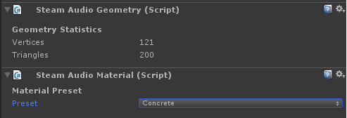

In the Steam Audio Material component that appears, click the **Preset** drop-down and choose a material preset.

##### Acoustic Material for Object Hierarchies
If you have an object with a Steam Audio Geometry component with Export All Children checked, and you attach a Steam 
Audio Material component to it, all its children are assigned the material of the root object. It is possible to assign 
a child object a different material by attaching a Steam Audio Material component to the child object.

> **NOTE**  
  If a Steam Audio Material component is added to a child object in a hierarchy, the material will be assigned only 
  to the mesh or terrain attached to that particular child object. If the child object has its own children, the 
  material of the children objects will not be affected.

##### Global Default Materials
For scenes where most objects are made of the same material, barring a few exceptions, you can save time by specifying a 
global default material. Then, you only have to add Steam Audio Material components to objects whose material is 
different from the default. To specify a global default material:

1.  In Unity's main menu, click **Window** > **Steam Audio**.
2.  Choose a material from the **Material Preset** drop-down box.

#### Adjusting Material Properties
Instead of choosing a material preset, you can use a custom material. To do so, select **Custom** from the Preset 
drop-down, either on a Steam Audio Material component, or for the global default material. Several sliders appear, 
allowing you to customize the material.

##### Absorption
The first three sliders, **Low Freq Absorption**, **Mid Freq Absorption**, and **High Freq Absorption**, let you specify 
how much sound the material absorbs at different frequencies. For example, setting High Freq Absorption to 1 means that 
the material absorbs all high frequency sound that reaches it. This adds a low-pass filtering effect to any sound 
reflected by the object.

> **NOTE**  
  The center frequencies for the three frequency bands are 400 Hz, 2.5 KHz, and 15 KHz.

##### Scattering
The fourth slider, **Scattering**, lets you specify how “rough” the surface is when reflecting sound. Surfaces with a 
high scattering value randomly reflect sound in all directions; surfaces with a low scattering value reflect sound in a 
mirror-like manner.

##### Transmission
The fifth through seventh sliders, **Low Freq Transmission**, **Mid Freq Transmission**, and **High Freq Transmission**,
let you specify how much sound the material transmits at different frequencies. For example, setting High Freq
Transmission to 0 means that no high frequency sound passes through the material. This adds a low-pass filtering effect
to any sound passing through the object.

> **NOTE**  
  The transmission coefficients are used only for direct sound occlusion calculations.

#### Scene Pre-Export
You must "pre-export" the scene before hitting Play in the Unity editor or building a player, to ensure scene setup 
changes are available to Steam Audio. To pre-export:

1.  In Unity’s main menu, click **Window** > **Steam Audio**.
2.  Click **Pre-Export Scene**.

#### Dynamic Geometry
Steam Audio can model the effect of dynamic geometry when simulating occlusion, transmission, and indirect sound in
real-time. For example, if a door opens, a previously occluded sound can become unoccluded; if a room is made larger,
reverb may change substantially.

There are two ways of enabling dynamic geometry support in Steam Audio. These approaches are mutually exclusive, so
you must choose based on the requirements of your project. The two approaches are:

- **Steam Audio Dynamic Object components**. This approach allows geometry to be moved, rotated, and scaled at
  run-time. Geometry may also be added to or removed from the scene at run-time. Geometry may not be deformed or
  broken in any way. Dynamic geometry is included in occlusion, transmission, and indirect sound simulations.
  This functionality requires the use of Embree as your ray tracer. (See below for more on how to enable Embree
  for your project.)

- **Unity's built-in ray tracer**. This approach allows geometry to change in any way supported by Unity's
  run-time ray tracer. Dynamic geometry is included in occlusion and transmission simulation only; indirect
  sound simulation is not supported. This approach is somewhat more flexible and supports a wider range of
  platforms as compared to Dynamic Object components, but is limited in terms of what can be simulated.

##### Steam Audio Dynamic Object
A Steam Audio Dynamic Object component can be attached to any GameObject in your scene hierarchy. Doing so tells
Steam Audio to treat that GameObject and all of its children as a dynamic object. At run-time, any changes made
to the Transform of the GameObject to which the Dynamic Object component has been attached will automatically be
passed to Steam Audio.

> **NOTE**  
  Changes made to the transforms of _children_ of the Dynamic Object will _not_ be passed to Steam Audio. The
  Dynamic Object and all its children must move/animate as a rigid body.

To specify that a GameObject (and all its children) should be treated as a dynamic object:

1.  In the Hierarchy tab, click the GameObject that you want to treat as dynamic.
2.  In the Inspector tab, click **Add Component**.
3.  In the Add Component menu, select **Steam Audio** > **Steam Audio Dynamic Object**.

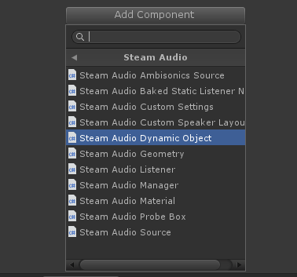

Just like with the static geometry in your scene, you still need to tag geometry and materials for dynamic objects.
This process is discussed in more detail below.

###### Tagging Geometry for Dynamic Objects
At least one of the Dynamic Object or its children must also have a Steam Audio Geometry component attached. The 
Geometry component works in the same way as for the static part of your scene; see above for more details on this 
process. Briefly, if a Geometry component is attached to a GameObject containing a Dynamic Object component (or one of 
its children):

- if the GameObject has a Mesh or Terrain component, its geometry is used by Steam Audio
- if **Export All Children** is checked, then the geometry of any Mesh or Terrain in the children of the GameObject
  is used by Steam Audio

A convenient approach to tagging dynamic geometry is to add a Geometry component to the GameObject containing the 
Dynamic Object component, and check Export All Children. This tells Steam Audio to use all geometry under the
Dynamic Geometry as dynamic geometry.

###### Tagging Materials for Dynamic Objects
The GameObject containing the Dynamic Object component must also have a Steam Audio Material component attached
(one is created automatically if needed). This Material is treated as the default material for the Dynamic Object,
and can by overriden by attaching Material components to children of the Dynamic Object. The scene-wide default
material is not used by Dynamic Objects.

Apart from this, tagging materials for dynamic geometry works similarly to static geometry. A common scenario for
dynamic objects that are mostly made of a single material is to just set the material once on the GameObject that
contains the Dynamic Object component.

###### Exporting Dynamic Objects
After tagging a Dynamic Object with Geometry and Material components, you must export it. Since dynamic objects can be
added or removed from a scene at any time during gameplay, they are not included when exporting the static portion of
the scene from the Steam Audio tab.

To export a dynamic object, select it and click **Export Dynamic Object** in the Inspector. You specify any file name
you like, as long as the file is saved under `Assets/StreamingAssets`.

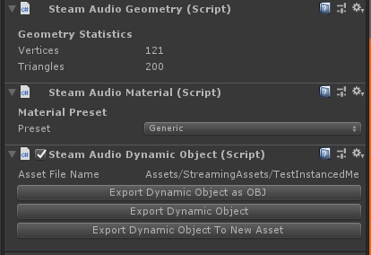

You can change the file to which the dynamic object is exported by clicking **Export Dynamic Object To New Asset**.
After this, the old exported file can be safely deleted.

If you make changes to the geometry or materials of a dynamic object, you must re-export it. To simplify the process
of re-exporting many dynamic objects, you can perform a batch re-export as follows:

1.  In Unity's main menu, click **Window** > **Steam Audio**.
2.  Under **Scene Export**, click **Export All Dynamic Objects**.

Steam Audio will search through your entire Unity project, find any Dynamic Object component that's present in any
scene or prefab, and re-export it. Dynamic Objects that haven't been exported at least once will be skipped
during this process.

###### Dynamic Objects in Prefabs
You can attach a Steam Audio Dynamic Object component in a prefab as well. After tagging the prefab with Geometry
and Material components and exporting it, the prefab can be freely instantiated in any scene and moved around;
Steam Audio will automatically update occlusion, transmission, and indirect sound accordingly. For example, this can
be used to create a door prefab that automatically occludes sound when added to any scene, or large walls that a
player can build, which automatically reflect sound.

##### Limited Dynamic Geometry Support with Unity Ray Tracer
If your game or app only uses occlusion, and not reflections or reverb, then Steam Audio can be configured to use 
Unity's built-in ray tracer to handle dynamic geometry. To do this:

1.  In the Hierarchy tab, click the **Steam Audio Manager Settings** object.
2.  In the Inspector tab, click **Add Component**.
3.  In the Add Component menu, select **Steam Audio** > **Steam Audio Custom Settings**.
4.  In the Steam Audio Custom Settings component, set **Ray Tracer Option** to **Unity**.

When using Unity's built-in ray tracer, you don't need to attach Steam Audio Geometry components to anything. However,
materials still must be specified using Steam Audio Material components.

With Unity's ray tracer, Steam Audio will automatically simulate the occlusion of sound by any collider. You can
fine-tune which colliders are used for occlusion as follows:

1.  In Unity’s main menu, click **Window** > **Steam Audio**.
2.  Under **Occlusion Settings**, click **Layer Mask**.
3.  Select the layers that you want to use for occlusion. Any colliders that have been placed in any of the selected
    layers will occlude sound.

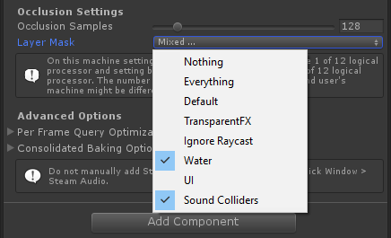

Refer to Unity's documentation for more information on placing objects in layers and creating new layers.

### Indirect Sound
Steam Audio offers an easy way to add environmental effects to your video games and VR experiences. Before Steam 
Audio can apply environmental effects to the Audio Source, a **Steam Audio Source** component must be attached to the
Audio Source. This can be done as follows:

1.  Select the GameObject containing the Audio Source.
2.  In the Inspector view, click **Add Component**.
3.  In the Add Component menu, select **Steam Audio** > **Steam Audio Source**.

#### Indirect Sound Settings
The Steam Audio Source component tells Unity what settings to use when applying environmental effects to the audio 
emitted by an Audio Source. Indirect sound settings can be changed while in Play mode or programmatically.

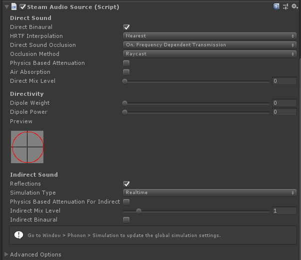

> **NOTE**  
  The Steam Audio Source component should be attached only to an Audio Source.

##### Reflections
If checked, Steam Audio will apply physics-based environmental effects to the audio emitted by the Audio Source. If 
unchecked, only direct sound settings (including occlusion) are applied.

##### Simulation Type
This determines what kind of simulation is performed to calculate environmental effects.

- **Realtime**. Environmental effects are continuously simulated in real-time, during gameplay. This allows for more 
  flexibility in incorporating changes to the scene and sources, but incurs a CPU overhead.

- **Baked Static Source**. The Audio Source must be static to use this simulation mode. Environmental effects are 
  precomputed from the source position during the design phase and saved with the scene. For largely static scenes, this 
  mode allows you to reduce CPU overhead at the cost of increased memory consumption.

- **Baked Static Listener**. The Audio Listener must be static or restricted to a few static positions to use this 
  simulation mode. The listener is free to look around but cannot move around. Environmental effects are precomputed 
  at a pre-determined listener position during the design phase and saved with the scene. Audio Sources can freely move 
  when using this mode. For a VR experience where the camera can only transport to a few locations, this mode allows you 
  to reduce CPU overhead at the cost of increased memory consumption.

##### Physics Based Attenuation For Indirect Sound
When checked (the default), Steam Audio applies a physics-based distance attenuation model (inverse distance falloff) to
every reflection path that sound can take as it bounces from the source to the listener. When unchecked, the distance
attenuation model specified in the Audio Source's Volume Rolloff curve will be applied to each reflection path instead.

When using the Unity editor, if the Volume Rolloff curve is changed while in Play mode, the indirect sound will update
automatically to match the new distance attenuation model.

##### Indirect Mix Level
Indirect Mix Level adjusts the contribution of indirect sound to the overall mix.

##### Indirect Binaural
If checked, renders indirect sound with HRTF-based 3D audio. This gives a better sense of directionality to indirect 
sound and improves immersion. There is a small increase in CPU overhead when checked.

#### Accelerated Mixing
If you are using Audio Mixers in your project, you can use the Steam Audio Mixer Return effect to reduce the CPU
overhead of audio processing for environmental effects. This can be done as follows:

1.  In the Audio Mixer view, select the Audio Mixer you want to use for mixing indirect sound.
2.  In any Mixer Group, click **Add Effect**, and choose **Steam Audio Mixer Return**.

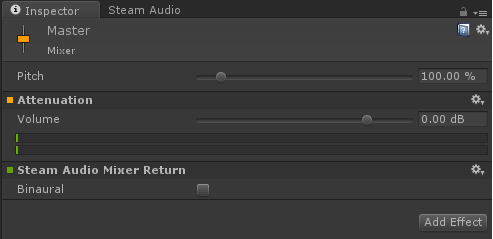

When using the Steam Audio Mixer Return effect, the following things happen:

- If indirect sound is enabled for a Steam Audio Source, then the indirect sound for that source is _not_ sent to the
  Audio Source's output. It is retained internally by Steam Audio for mixing. Only direct sound is sent to the
  Audio Source's output.

- All of the indirect sound for all Steam Audio Sources is mixed, and inserted back into the audio pipeline at the
  Mixer Group to which the Steam Audio Mixer Return effect has been added.

- Since indirect sound is taken out of Unity's audio pipeline at the Audio Source, any effects applied between the
  Audio Source and the Steam Audio Mixer Return effect will not apply to indirect sound.

##### Steam Audio Mixer Return Settings
The following settings can be configured on a Steam Audio Mixer Return effect:

###### Binaural
If checked, applies HRTF-based 3D audio rendering to indirect sound.

> **NOTE**  
  When a Steam Audio Mixer Return effect is attached to an Audio Mixer, the Binaural setting of the Steam Audio 
  Mixer Return effect overrides the Indirect Binaural settings on Steam Audio Source components in the scene.

##### Advanced Options
The following advanced options can be configured for a Steam Audio Mixer Return effect.

###### Avoid Silence During Init
Under some circumstances, Steam Audio Mixer Return effects may take a few audio frames' worth of time to initialize. If 
this happens, the default behavior is for a Steam Audio Mixer Return effect to emit silence while initialization is 
ongoing. Checking this box modifies this behavior: the Steam Audio Mixer Return effect will pass its input audio 
unmodified while initialization is ongoing.

The default behavior is desirable for the common case where an occluded sound should not be audible for a few frames
while initialization occurs. On the other hand, for some kinds of sounds, like dialog, the default behavior may result
in the first few syllables becoming inaudible; checking this box will allow all the dialog to be heard.

#### Simulation Settings
Steam Audio allows you to balance its compute requirements and simulation output quality. To adjust these settings:

1.  In Unity’s main menu, click **Window** > **Steam Audio**.
2.  Under **Simulation Preset**, choose from Low, Medium, High, or Custom.

##### Custom Preset for Simulation Settings
The custom simulation preset lets you configure various aspects of how Steam Audio simulates indirect sound. These 
options cannot be changed in Play mode or programmatically.

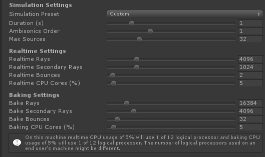

- **Duration**. This is the length of the impulse responses to generate. Increasing this improves the quality of the 
  simulation, but beyond a certain point (depending on the number of sound sources), may result in audio glitching.

- **Ambisonics Order**. This determines the directionality of environmental effects. Increasing this increases the 
  compute complexity quadratically. Use zero order Ambisonics if no directionality is needed in environmental effects. 
  Otherwise, first order Ambisonics should provide a good tradeoff between directionality and CPU usage.

- **Max Sources**. This is the maximum number of Steam Audio Sources and Steam Audio Reverb effects combined that can 
  be used for modeling indirect sound.

- **Realtime Rays**. This is the number of primary and reflection rays to trace from the listener position for real-time 
  computation of environmental effects. Increasing this improves the quality of the simulation, at the cost of 
  performance.

- **Realtime Secondary Rays**. This is the number of directions that are sampled when simulating diffuse reflection. 
  Setting this number too low may reduce the overall quality.

- **Realtime Bounces**. Number of times the rays are allowed to bounce off of solid objects in real-time. Increasing 
  this improves the quality of the simulation, at the cost of performance.

- **Realtime Bounces**. Number of times the rays are allowed to bounce off of solid objects in real-time. Increasing 
  this improves the quality of the simulation, at the cost of performance.

- **Realtime CPU Cores (%)**. Percentage of CPU cores to use on an end user's machine for performing real-time computation 
  of environmental effects. The percentage can also be interpreted as the number of threads to create as a percentage 
  of the total logical cores available on the machine of an end user. Increasing realtime CPU usage leads to faster 
  update of the simulation and lower latency.

- **Bake Rays**. This is the number of primary and reflection rays to trace from the listener position for baked 
  computation of environmental effects. Increasing this improves the quality of the simulation while increasing the 
  overall time to bake environmental effects.

- **Bake Secondary Rays**. This is the number of directions that are sampled when simulating diffuse reflection. Setting 
  this number too low may reduce the overall quality.

- **Bake Bounces**. Number of times the rays are allowed to bounce off of solid objects during baking. Increasing this 
  improves the quality of the simulation while increasing the overall time to bake environmental effects.

- **Baking CPU Cores (%)**. Percentage of CPU cores to use on a developer's machine for baking environmental effects during
  the design phase. The percentage can also be interpreted as the number of threads to create as a percentage of the total 
  logical cores available on the machine of a developer. Increasing baking CPU usage leads to lower bake times and faster
  turnaround.

- **Irradiance Min Distance**. The minimum distance between a source and a scene surface, used when calculating the energy 
  received at the surface from the source during indirect sound simulation. Increasing this number reduces the loudness of 
  reflections when standing close to a wall; decreasing this number results in a more physically realistic model.

### Reverb
Steam Audio also lets you apply listener-centric reverb to audio flowing through any Mixer Group in Unity. This helps
reduce CPU usage, since indirect sound effects are applied after multiple sounds are mixed. When using listener-centric
reverb, Steam Audio calculates and applies a reverb filter based on the listener's position in the scene; it does not
take source positions into account.

To use Steam Audio for modeling listener-centric reverb:

1.  In the Audio Mixer tab, select the Mixer Group to which you want to apply listener-centric reverb.
2.  Click **Add Effect**, then choose **Steam Audio Reverb**.

After doing this, Steam Audio will apply listener-centric reverb to all audio reaching the Mixer Group, either from
Audio Sources whose output is set to the Mixer Group, or from other Mixer Groups that route audio to the selected
Mixer Group.

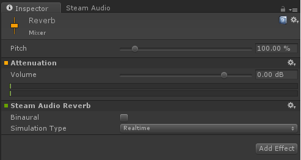

The following settings can be configured for the Steam Audio Reverb effect:

#### Simulation Type
Simulation Type determines what kind of simulation is performed to calculate reverb.

- **Realtime**. Reverb is continuously simulated in real-time, during gameplay. This allows for more flexibility 
  in incorporating changes to the scene and sources, but incurs a CPU overhead.

- **Baked**. Reverb is precomputed over a grid of listener positions during the design phase and saved with the 
  scene. For largely static scenes, this mode allows you to reduce CPU overhead at the cost of increased memory 
  consumption.

#### Binaural
If checked, applies HRTF-based 3D audio rendering to reverb.

> **NOTE**  
  Listener-centric reverb (using the Steam Audio Reverb effect) and accelerated mixing (using the Steam Audio Mixer
  Return effect) are mutually-exclusive features. You cannot use both kinds of effects at the same time.

#### Advanced Options
The following advanced options can be configured for a Steam Audio Reverb effect.

##### Avoid Silence During Init
Under some circumstances, Steam Audio Reverb effects may take a few audio frames' worth of time to initialize. If this 
happens, the default behavior is for a Steam Audio Reverb effect to emit silence while initialization is ongoing. 
Checking this box modifies this behavior: the Steam Audio Reverb effect will pass its input audio unmodified while 
initialization is ongoing.

The default behavior is desirable for the common case where an occluded sound should not be audible for a few frames
while initialization occurs. On the other hand, for some kinds of sounds, like dialog, the default behavior may result
in the first few syllables becoming inaudible; checking this box will allow all the dialog to be heard.

### 3D Audio For Indirect Sound
Steam Audio provides the following ways of applying HRTF-based 3D audio rendering to indirect sound:

- If not using accelerated mixing, you can check Indirect Binaural on an individual Steam Audio Source.
- If using accelerated mixing, you can check Indirect Binaural on the Steam Audio Mixer Return effect.
- If using listener-centric reverb, you can check Indirect Binaural on the Steam Audio Reverb effect.

### Baking Indirect Sound
A few additional steps need to be performed to use the **Baked Static Source** or **Baked Static Listener** options in a 
Steam Audio Source and the **Baked** setting in a Steam Audio Reverb effect. You must create probe boxes, assign them 
in the Steam Audio Source component or Steam Audio Reverb effect, and perform a bake.

#### Creating Probe Boxes
Steam Audio uses _probes_ to store baked environmental effect data. A Probe Box is a way to create and manage probes. To 
create a Probe Box:

1.  In Unity’s main menu, click **GameObject** > **Create Empty**.
2.  In the Hierarchy view, give the newly-created GameObject any preferred name. **All Probe Boxes should have a unique 
    name.**
3.  In the Inspector view, click **Add Component**.
4.  In the Add Component menu, click **Steam Audio** > **Steam Audio Probe Box**.
5.  Adjust the position and size of the Probe Box using Unity's translate, rotate, and scale tools.
6.  Choose an appropriate **Placement Strategy**. (See below for details.)
7.  Click **Generate Probes**.

##### Dimensions
A Probe Box is a parallelopiped volume. The position, shape, and scale of the probe box is determined by the local to
world transformation matrix of the GameObject to which Probe Box component is attached.

##### Placement Strategy
Steam Audio currently supports the following strategies to generate probes within a Probe Box.

- **Centroid**. Places a single probe at the center of the Probe Box.

- **Uniform Floor**. Places probes at a certain height above the floor in the direction of the local down vector of 
  the probe box with a certain spacing between them. The height is specified by the **Height Above Floor** parameter. 
  Spacing is specified by the **Horizontal Spacing** parameter.

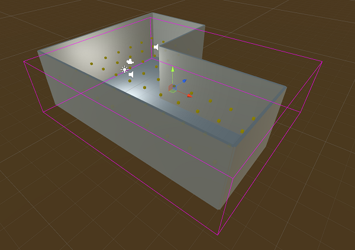

##### Probe Box Statistics
Probe Box Statistics provides information about the number of probes and the size of the baked data at the probes.

#### Baked Reverb Settings
To configure baked reverb, you must first add a Steam Audio Listener component to the GameObject that contains the
Unity Audio Listener component:

1.  Select the GameObject containing the Audio Listener.
2.  In the Inspector view, click **Add Component**.
3.  In the Add Component menu, click **Steam Audio** > **Steam Audio Listener**.

Baked Reverb Settings will be displayed in the Steam Audio Listener component. The environmental effect that is baked at 
a probe's location represents the reverb at that location.

##### Use All Probe Boxes
If checked, all Probe Boxes are used when baking reverb. If unchecked, you can specify a list of Probe Boxes for which 
to bake reverb.

#### Baked Static Source Settings
Baked Static Source settings will be displayed in a Steam Audio Source component when its Simulation Type is set to 
Baked Static Source. The environmental effect that is baked at a probe's location represents sound propagation from the 
source location to the probe's location.

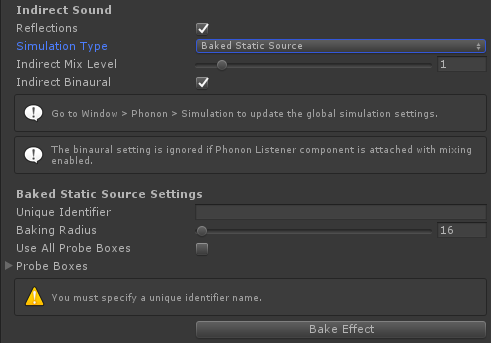

##### Unique Identifier
Each Steam Audio Source whose Simulation Type is set to Baked Static Source must have a unique identifier.

##### Baking Radius
Environmental effects are baked for all probes within the baking radius of a Steam Audio Source. A smaller baking radius 
implies fewer probes need to be baked, so less data needs to be stored.

##### Use All Probe Boxes
If checked, all Probe Boxes are used when baking environmental effects for the source. If unchecked, you can specify a 
list of Probe Boxes for which to bake environmental effects.

> **NOTE**  
  Baking indirect sound effects for a static sources causes the source directivity to be baked into the data as well.
  This means that a baked static source cannot be rotated at run-time; the directivity will not rotate along with it,
  and the results will not be accurate.

#### Baked Static Listener Settings
To use Baked Static Listener simulation on a Steam Audio Source, you must first create one or more **Steam Audio Baked
Static Listener Node** components. You must also add and configure a Steam Audio Listener component to the Audio 
Listener.

##### Baked Static Listener Nodes
One or more **Steam Audio Baked Static Listener Node** components must be attached to GameObjects at the fixed locations 
to which Audio Listener can transport. Bakes performed at each Baked Static Listener Node represent sound propagation 
from each probe location to the location of the static listener node.

###### Unique Identifier
Each Steam Audio Baked Static Listener Node component must have a unique identifier.

###### Baking Radius
Environmental effects are baked for all probes within the baking radius of a Baked Static Listener Node. A smaller 
baking radius implies fewer probes need to be baked, so less data needs to be stored.

###### Use All Probe Boxes
If checked, all Probe Boxes are used when baking environmental effects for the static listener. If unchecked, you can 
specify a list of Probe Boxes for which to bake environmental effects.

##### Steam Audio Listener configuration
A **Steam Audio Listener** component needs to be attached to the Audio Listener when Simulation Type is set to Baked 
Static Listener for any Steam Audio Source component. The following settings must be configured:

##### Current Static Listener Node
Points to the latest Steam Audio Baked Static Listener Node where the Audio Listener is located.

> **NOTE**  
  You must also attach Baked Static Listener Node components to use Baked Static Listener settings in a Steam Audio
  Source.

#### Baking
Click **Bake** on a Steam Audio Source or Steam Audio Listener component to bake the corresponding environmental 
effects. The baked data is stored in the Probe Boxes selected within Steam Audio Source or Steam Audio Listener 
components.

##### Baked Data Statistics
Baked data statistics for a component are readily available in a foldout at the end of the component. The actual name of 
the foldout may vary depending on the component baked, i.e. Steam Audio Source, Steam Audio Listener, or Steam Audio 
Baked Static Listener Node.

### Advanced Options
The following advanced options are available on the Steam Audio tab.

#### AMD TrueAudio Next
Steam Audio provides optional support for AMD TrueAudio Next, which allows you to reserve a portion of the GPU for
accelerating convolution operations. TrueAudio Next requires a supported AMD Radeon GPU. 

If you choose to enable TrueAudio Next support in your Unity project, then Steam Audio will try to use the GPU to 
accelerate the rendering of indirect sound, including real-time source-centric propagation, baked static source 
propagation, baked static listener propagation, real-time listener-centric reverb, and baked listener-centric reverb.

> **NOTE**  
  TrueAudio Next only supports Windows 64-bit platform. Steam Audio falls back to using CPU based convolution for
  platforms not supported by TrueAudio Next.

##### Enabling TrueAudio Next
Before enabling TrueAudio Next, you must download the Steam Audio TrueAudio Next support package for Unity
(`SteamAudio_TrueAudioNext.unitypackage`). Then:

1.  From the Unity menu, choose **Assets** > **Import Package** > **Custom Package**.
2.  Navigate to the directory where you downloaded the Steam Audio TrueAudio Next support package. Within this
    folder, navigate to the <code>bin/unity/</code> subdirectory.
3.  Double-click the <code>SteamAudio_TrueAudioNext.unitypackage</code> file.
4.  In the Import dialog box that appears, make sure everything is selected, and click the **Import** button.

Next, for each Unity scene in which you want to enable TrueAudio Next, follow these steps:

1.  In the Hierarchy tab, click the **Steam Audio Manager Settings** object.
2.  In the Inspector tab, click **Add Component**.
3.  In the Add Component menu, select **Steam Audio** > **Steam Audio Custom Settings**.
4.  In the Steam Audio Custom Settings component, set **Convolution Option** to **TrueAudio Next**.

Now whenever the scene is loaded, either in the Unity editor or in a standalone player, Steam Audio will attempt
to use TrueAudio Next for convolution. If the user's PC does not contain a supported GPU (or the configured
resource reservation settings are not supported by the user's GPU; see below for details), Steam Audio will
seamlessly fall back to using the CPU for convolution, as usual.

> **NOTE**  
  When using TrueAudio Next, we strongly recommend that you use the Steam Audio Mixer Return effect if possible,
  for the best performance.

##### Settings Overrides
When TrueAudio Next is enabled in the Steam Audio Custom Settings component, you can also override some of the
simulation settings that are normally configured on the Steam Audio Manager Settings component. These include
**Duration**, **Ambisonics Order**, and **Max Sources**.

These overrides allow you to switch to a higher level of acoustic detail when the user's PC has a supported
GPU, while seamlessly falling back to using the CPU with the settings configured on the Steam Audio Manager
Settings component if a supported GPU is not found.

##### GPU Resource Reservation
When TrueAudio Next is enabled in the Steam Audio Custom Settings component, you can configure the following
GPU Resource Reservation settings, which allow you to control how much of the GPU is set aside for audio processing
tasks:

- **Max Compute Units To Reserve**. This is the largest number of CUs that Steam Audio will try to reserve for audio
  processing at runtime. When set to 0, entire GPU is used for audio processing. If compute units fewer than minimum
  possible reservable on a particular GPU are requested, TrueAudio Next initialization will fail. For example, if
  **Max Compute Units To Reserve** is set to 2 and minimum number of compute units that can be reserved on a user's 
  GPU are 4, TrueAudio Next initialization will fail.

- **Fraction Compute Units for IR Update**. Multiple resources can be reserved by Steam Audio on GPU for audio 
  processing and other tasks like preparing IR calculated on CPU for audio processing or indirect sound processing 
  on GPU (see section on **Radeon Rays** below). This value determines the fraction of **Max Compute Units To Reserve** 
  used for IR update. For example, if **Max Compute Units To Reserve** is set to 8 and **Fraction Compute Units for IR Update** 
  is set to 0.5, then 4 compute units are used for audio processing and 4 compute units are used for IR update.

#### Intel&reg; Embree
Steam Audio provides optional support for Intel&reg; Embree, which uses highly optimized CPU ray tracing for accelerating 
real-time simulation and baking. Embree support will work on any modern CPU based on the x86 or x86_64 architectures, 
as long as Streaming SIMD Extensions 2 (SSE2) instructions are supported. CPUs that support Advanced Vector eXtensions 
(AVX) or AVX2 instructions will result in improved performance when using Embree support.

> **NOTE**  
  Embree support is only available on Windows (64-bit), Linux (64-bit), and macOS (64-bit). Embree support on
  macOS is available only on Macs released in 2011 or later.

##### Enabling Embree
Before enabling Embree, you must download the Steam Audio Embree support package for Unity 
(`SteamAudio_Embree.unitypackage`). Then:

1.  From the Unity menu, choose **Assets** > **Import Package** > **Custom Package**.
2.  Navigate to the directory where you downloaded the Steam Audio Embree support package. Within this folder, 
    navigate to the `bin/unity/` subdirectory.
3.  Double-click the `SteamAudio_Embree.unitypackage` file.
4.  In the Import dialog box that appears, make sure everything is selected, and click the **Import** button.

Next, for each Unity scene in which you want to enable Embree, follow these steps:

1.  In the Hierarchy tab, click the **Steam Audio Manager Settings** object.
2.  In the Inspector tab, click **Add Component**.
3.  In the Add Component menu, select **Steam Audio** > **Steam Audio Custom Settings**.
4.  In the Steam Audio Custom Settings component, set **Ray Tracer Option** to **Embree**.

#### AMD Radeon Rays
Steam Audio provides optional support for AMD Radeon Rays, which uses GPU-optimized ray tracing for accelerating
real-time simulation and baking. Radeon Rays support in Steam Audio requires a supported AMD GPU or other OpenCL 1.2+
device.

> **NOTE**  
  Radeon Rays support is only available on Windows (64-bit).

##### Enabling Radeon Rays
Before enabling Radeon Rays, you must download the Steam Audio Radeon Rays support package for Unity
(`SteamAudio_RadeonRays.unitypackage`). Then:

1.  From the Unity menu, choose **Assets** > **Import Package** > **Custom Package**.
2.  Navigate to the directory where you downloaded the Steam Audio Radeon Rays support package. Within this folder, 
    navigate to the `bin/unity/` subdirectory.
3.  Double-click the `SteamAudio_RadeonRays.unitypackage` file.
4.  In the Import dialog box that appears, make sure everything is selected, and click the **Import** button.

Next, for each Unity scene in which you want to enable Radeon Rays, follow these steps:

1.  In the Hierarchy tab, click the **Steam Audio Manager Settings** object.
2.  In the Inspector tab, click **Add Component**.
3.  In the Add Component menu, select **Steam Audio** > **Steam Audio Custom Settings**.
4.  In the Steam Audio Custom Settings component, set **Ray Tracer Option** to **Radeon Rays**.

##### Radeon Rays Settings
When Radeon Rays is enabled in the Steam Audio Custom Settings component, you can configure the following settings,
which allow you to control how the GPU used for baking:

- **Baking Batch Size**. This is the number of probes that are simultaneously baked on the GPU. Increasing this number
  results in better utilization of available GPU compute resources, at the cost of increased GPU memory consumption.
  If this number is set too high, you may encounter errors when baking; if this happens, reduce the Baking Batch Size 
  value until baking succeeds.

##### GPU Resource Reservation
GPU Resource Reservation reserves a portion of GPU (specified as number of compute units) for calculating real-time indirect 
sound. This way, real-time indirect sound calculation is restricted to reserved GPU resources only and they do not interfere
with other rendering or other game logic using GPU resources during runtime. For baking, entire GPU is always used.

- **Max Compute Units To Reserve**. Maximum number of compute units to reserve on GPU for real-time indirect sound simulation. 
When set to 0, entire GPU is used for real-time simulation. For baking, entire GPU is always used. If TrueAudio Next is enabled, 
dual resource reservation is active and different amout of GPU resources are reserved for IR update / real-time indirect sound 
and real-time convolution.

#### Per Frame Query Optimization
Steam Audio searches the Unity scene graph for an Audio Listener and a Steam Audio Listener every frame. This requires 
making an expensive <code>FindObjectOfType</code> call per frame in Unity. When **Update Component** is unchecked in 
Per Frame Query Optimization, this per frame call to <code>FindObjectOfType</code> will not be made. This option should 
be used if the Audio Listener or Steam Audio Listener are not expected to change during the game.

#### Consolidated Baking Options
Provides a single place for generating probes and baking data for various Steam Audio components. This option is 
provided primarily for convenience in accessing all baking-related functionality from one place. It is still possible to 
generate probes and bake data individually for each component.

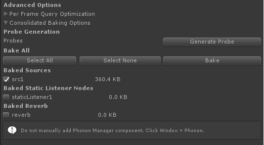
